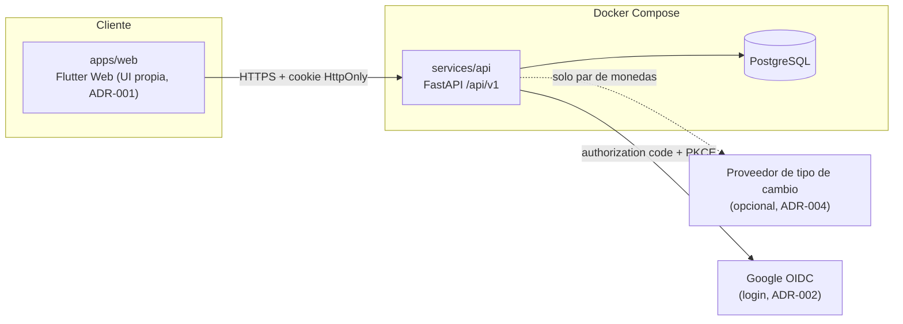
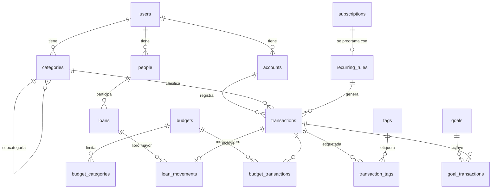

# ARCHITECTURE.md — Monetae

> Versión 0.1 · 2026-10-07 · Autor: Claude (T-101) · Estado: borrador para revisión de Adrian
> Fuente funcional: `docs/SPEC.md` v0.3. Reglas de código: `AGENTS.md`. Decisiones: `docs/decisions/`.
> El esquema de este documento es el **contrato de datos** de la Fase 2; las migraciones Alembic lo implementan. Si el código necesita desviarse, se cambia primero este documento.

---

## 1. Visión general



Reservado, sin implementar en V1: `services/bot` (Telegram), `services/ml` (clasificador), asistente MCP, app Android (SPEC §3, §13).

## 2. Decisiones vinculantes

| ADR | Decisión |
|-----|----------|
| 001 | UI propia en Flutter Web que reutiliza y desacopla widgets de Cashew; consume solo la API |
| 002 | Sesión en servidor (cookie `HttpOnly`, `Secure`, `SameSite=Lax`), Google OIDC + correo/contraseña (argon2id); tokens de dispositivo en V2–V4 |
| 003 | Interés en base caja; cada pago se reparte primero a interés y luego a capital, y se guarda el reparto |
| 004 | Tipo de cambio manual manda; sugerencia automática tras la interfaz `RateProvider` |
| 006 | Bloqueo de app: PIN primero, WebAuthn opcional después (barrera de comodidad) |
| 007 | SQLAlchemy 2.0 síncrono + psycopg 3; endpoints `def` |

## 3. Capas y dependencias (`services/api/src/monetae/`)

```
domain/      reglas puras: Money, préstamos, suscripciones, presupuestos, FX. Sin I/O.
db/          modelos SQLAlchemy (Mapped[...]), repositorios, migraciones Alembic.
api/         routers, schemas Pydantic v2 estricto, dependencias (sesión, usuario actual).
importers/   importador de Cashew (lee SQLite en solo lectura).
reports/     consultas agregadas (SQL) para gráficos y herramientas futuras.
```

- `domain` no importa de `api`, `db` ni `importers`. `api`, `db`, `importers` y `reports` dependen de `domain`.
- **Los routers no contienen reglas de negocio:** validan, llaman a un servicio de aplicación y serializan. Un *servicio de aplicación* carga datos con repositorios, invoca funciones de `domain` y persiste.
- **Puertos** (interfaces definidas en `domain`, implementadas fuera): `RateProvider` (tipo de cambio), `Clock` (tiempo inyectable para pruebas), y los repositorios.
- Toda operación de repositorio recibe `user_id` obligatorio; no existe una consulta de negocio sin él (AGENTS.md §6.9). Defensa en profundidad con *Row Level Security* de PostgreSQL: **se evalúa en la Fase 7**, no es requisito de V1.
- Endpoints con `def` (ADR-007). Prohibido bloquear dentro de `async def`.

## 4. Convenciones de datos

| Tema | Regla |
|------|-------|
| Identificadores | `uuid` v4 como PK. Las tablas de negocio llevan `user_id uuid NOT NULL` con FK a `users` |
| Columnas comunes | `id`, `user_id`, `created_at timestamptz`, `updated_at timestamptz`, `deleted_at timestamptz NULL` (borrado lógico). En las tablas siguientes se omiten salvo excepción |
| Dinero | `NUMERIC(18,2)`; nunca `float`. En Python `Decimal`/`Money`, redondeo `ROUND_HALF_UP` |
| Tipo de cambio | `NUMERIC(18,6)` |
| Moneda | `char(3)` ISO 4217 en mayúsculas (`CHECK (currency = upper(currency))`) |
| Tiempo | `timestamptz` en UTC; fechas sin hora como `date`; presentación en `America/Lima` |
| Enumeraciones | `text` con `CHECK (col IN (...))` (más fácil de migrar que `ENUM` de PostgreSQL) |
| Unicidad con borrado lógico | Índices únicos **parciales** `WHERE deleted_at IS NULL` |
| Saldos y estados | Se **calculan** (vistas/consultas), no se guardan como verdad (AGENTS.md §6.8) |
| Actualización | `updated_at` se fija en cada escritura (útil para ADR-005/V4) |

## 5. Esquema de base de datos

### 5.1 Diagrama (entidades centrales)



### 5.2 Identidad y acceso

**`users`** (no lleva `user_id`; su `id` es el usuario)
| Columna | Tipo | Notas |
|---------|------|-------|
| email | `text NOT NULL` | único parcial en `lower(email)` |
| password_hash | `text NULL` | argon2id; NULL si solo entra con Google |
| google_sub | `text NULL` | único parcial; vinculación solo con correo verificado (ADR-002) |
| timezone | `text NOT NULL DEFAULT 'America/Lima'` | |
| base_currency | `char(3) NOT NULL DEFAULT 'PEN'` | moneda de reporte por defecto |
| locale | `text NOT NULL DEFAULT 'es'` | `es`/`en` |
| pin_hash | `text NULL` | argon2id (ADR-006) |
| pin_failed_attempts | `int NOT NULL DEFAULT 0` | a los 5 se exige login completo |
| lock_after_minutes | `int NULL` | inactividad para bloquear; NULL = sin bloqueo |

**`sessions`**
| Columna | Tipo | Notas |
|---------|------|-------|
| token_hash | `bytea NOT NULL` | SHA-256 del token de la cookie; el token en claro nunca se guarda |
| last_seen_at, expires_at | `timestamptz` | expiración por inactividad y absoluta |
| user_agent, ip | `text` | para listar dispositivos |
| revoked_at | `timestamptz NULL` | "cerrar sesión en todos los dispositivos" revoca todas las del usuario |

Índice único en `token_hash`; índice `(user_id, revoked_at)`.

**`webauthn_credentials`** *(Fase 6)*: `credential_id bytea UNIQUE`, `public_key bytea`, `sign_count bigint`, `label text`.

### 5.3 Cuentas, categorías, personas, etiquetas

**`accounts`**: `name`, `type` ∈ {`cash`,`bank`,`wallet`,`card`,`other`}, `currency char(3)`, `initial_balance NUMERIC(18,2) DEFAULT 0`, `color`, `icon`, `sort_order int`, `archived_at`.
- `UNIQUE (id, currency)` (para la FK compuesta de `transactions`).
- Único parcial `(user_id, lower(name))` entre cuentas no borradas.
- **Saldo actual** = `initial_balance + SUM(transactions.amount)` de las transacciones `posted` no borradas (RF-02). No existe columna de saldo.

**`categories`**: `parent_id uuid NULL → categories`, `kind` ∈ {`income`,`expense`}, `name`, `icon`, `color`, `is_system bool`, `system_key text NULL`.
- Un solo nivel de subcategorías: `parent_id` debe apuntar a una categoría sin padre y del mismo `kind` (validado en dominio y con trigger de respaldo).
- Categorías de sistema de interés: `system_key` ∈ {`interest_income`, `interest_expense`}; únicas por usuario; no editables ni borrables. Se crean al registrar al usuario.

**`people`**: `name`, `aliases text[] NOT NULL DEFAULT '{}'`, `note`. Índice GIN en `aliases` y en `lower(name)` (búsqueda por nombre o alias, RF-23).

**`tags`**: `name`, `color`, `icon`, `emoji`, `sort_order`, `archived_at`. Único parcial `(user_id, lower(name))` entre no archivadas ni borradas (RF-43).

**`transaction_tags`**: `transaction_id`, `tag_id`, columnas comunes (con `deleted_at`: quitar una etiqueta es borrado lógico, RF-44). Único parcial `(transaction_id, tag_id) WHERE deleted_at IS NULL`. Índice `(user_id, tag_id)` para el filtro (RF-45).

### 5.4 Transacciones

**`transactions`** (todo movimiento real de dinero en una cuenta)
| Columna | Tipo | Notas |
|---------|------|-------|
| account_id, currency | `uuid`, `char(3)` | **FK compuesta** `(account_id, currency) → accounts(id, currency)`: la moneda es siempre la de la cuenta |
| kind | `text` | `income`, `expense`, `transfer`, `loan` |
| amount | `NUMERIC(18,2) NOT NULL` | **con signo**: positivo = entra a la cuenta, negativo = sale; nunca 0 |
| category_id | `uuid NULL` | NULL en `transfer` y `loan` |
| occurred_at | `timestamptz` | |
| status | `text` | `posted` (cuenta en saldos) o `scheduled` (próxima, RF-09; no cuenta hasta que ocurre) |
| title, note | `text` | |
| fx_rate_to_base | `NUMERIC(18,6) NOT NULL` | 1 si la moneda es la base; **fijo al registrar, no se recalcula** (SPEC §9.2) |
| fx_rate_source | `text` | `manual` / `auto` |
| transfer_group_id | `uuid NULL` | enlaza las dos patas de una transferencia (mismo `kind='transfer'`, montos reales en ambas monedas) |
| recurring_rule_id | `uuid NULL` | regla que lo generó |
| source | `text` | `web`, `import`, `telegram`, `api` |
| raw_input | `text NULL` | texto original (V2) |
| categorization_source | `text NULL` | `manual`, `rule`, `model`, `llm` (V2) |
| is_initial_data | `bool DEFAULT false` | marca ago–oct 2025 importados (RF-40e) |
| import_external_id | `text NULL` | p. ej. `cashew:sqlite:<transaction_pk>`; único parcial por usuario (idempotencia, RF-40b) |

Restricciones: `CHECK (amount <> 0)`. `category_id` es **nullable** en todos los tipos (se pueden registrar movimientos sin categoría y sugerirla después con reglas); la API exige categoría solo donde el producto lo decida. Una transferencia tiene exactamente 2 filas por `transfer_group_id` (validado en dominio) y una transacción `loan` no lleva categoría.

Índices: `(user_id, occurred_at DESC)`, `(user_id, account_id, occurred_at DESC)`, `(user_id, category_id, occurred_at)`, `(user_id, status, occurred_at)` y, para búsqueda de texto, `GIN (to_tsvector('spanish', title || ' ' || coalesce(note,'')))`. Todos parciales `WHERE deleted_at IS NULL`.

**`attachments`**: `transaction_id`, `filename`, `content_type`, `size_bytes`, `storage_key` (disco local en V1; el almacenamiento externo queda para después).

### 5.5 Préstamos (núcleo, SPEC §7, ADR-003)

**`loans`**: `person_id → people`, `direction` ∈ {`lent`,`borrowed`}, `currency`, `principal NUMERIC(18,2) > 0`, `opened_on date`, `due_on date NULL`, `note`, `import_external_id text NULL` (único parcial). **No existe columna de estado ni de saldo.**

**`loan_movements`** (libro mayor; inmutable salvo edición explícita)
| Columna | Tipo | Notas |
|---------|------|-------|
| loan_id | `uuid` | |
| kind | `text` | `disbursement`, `interest`, `payment`, `adjustment`, `write_off` |
| amount_in_loan_currency | `NUMERIC(18,2)` | `> 0` salvo `adjustment`, que es con signo y `<> 0` |
| transaction_id | `uuid NULL` | transacción real (`kind='loan'`); NULL si no hay dinero (interés registrado, ajuste, condonación) o si es un préstamo importado sin desembolso. **Único** cuando no es NULL |
| interest_part, principal_part | `NUMERIC(18,2) NULL` | solo en `payment`; `interest_part + principal_part = amount_in_loan_currency`, ambos `>= 0` (ADR-003) |
| fx_rate_applied | `NUMERIC(18,6) NULL` | si la cuenta usada tiene otra moneda que el préstamo (Ejemplo C) |
| occurred_at | `timestamptz` | |
| note | `text` | |

Reglas:
- **Cada movimiento con dinero usa su propia cuenta**, porque apunta a su propia `transactions` (resuelve P3). El desembolso y los cobros pueden ir a cuentas y monedas distintas.
- Exactamente un `disbursement` por préstamo, con `amount_in_loan_currency = loans.principal`. El desembolso **no suma al saldo**: el principal ya está en `loans`.
- Estadísticas: el **capital** (desembolso y `principal_part`) no cuenta como gasto ni ingreso; sí cambia el saldo de la cuenta. `interest_part` cuenta como gasto (`borrowed`) o ingreso (`lent`) en la categoría de sistema de interés, **en la fecha del pago** (ADR-003).
- Signo de la transacción real (`kind='loan'`): desembolso negativo si `lent` (sale dinero) y positivo si `borrowed` (entra); pago negativo si `borrowed` (pago al prestamista) y positivo si `lent` (cobro).

**Vista `loan_balances`** (cálculo, nunca columna):
```
saldo = principal
      + SUM(amount) FILTER (kind IN ('interest','adjustment'))
      - SUM(amount) FILTER (kind IN ('payment','write_off'))
estado = CASE WHEN saldo = 0 THEN 'settled' ELSE 'open' END   -- no existe botón "liquidar" (P2)
```
Un saldo negativo no se permite: el dominio rechaza (RF-22) el pago que excede el saldo y ofrece registrar el exceso como ajuste o como ingreso/gasto.

**Reparto de un pago (dominio, `domain/loans.py`):** al registrar un pago de importe `p`, el interés pendiente es `SUM(interest) − SUM(interest_part de pagos previos)` (más ajustes positivos asignados a interés si se definen); `interest_part = min(p, interés_pendiente)`; `principal_part = p − interest_part`. El usuario puede editar el reparto antes de guardar; el dominio valida que no supere lo pendiente de cada concepto.

*Ejemplo A (me prestaron S/ 200):* interés 5 % → movimiento `interest` 10, saldo 210. Pago 100 (BCP): `interest_part 10`, `principal_part 90`, saldo 110. Pago 110 (Efectivo): `interest_part 0`, `principal_part 110`, saldo 0 → `settled`. En estadísticas aparece **un solo gasto de S/ 10** ("Intereses"), con fecha del primer pago; Efectivo +200 −110, BCP −100.

### 5.6 Suscripciones y recurrencias

**`recurring_rules`**: plantilla (`account_id`, `kind`, `amount`, `category_id`, `title`, `note`), `period` ∈ {`daily`,`weekly`,`monthly`,`yearly`}, `interval_count int DEFAULT 1`, `next_run_on date`, `end_on date NULL`, `active bool`, `subscription_id uuid NULL`.

**`subscriptions`**: `title`, `amount NUMERIC(18,2)`, `currency`, `account_id` (FK compuesta con la moneda), `category_id`, `period`, `interval_count`, `next_due_on date`, `status` ∈ {`active`,`archived`}, `archived_at`, `archive_reason`, `reminder_days_before int NULL`, `recurring_rule_id`.

Reglas (SPEC §8): **archivar** = `status='archived'` + `archived_at` + desactivar la regla + borrado lógico de las transacciones futuras `scheduled` de esa suscripción; **no toca** transacciones pasadas. Los totales mensual/anual y el gráfico consideran solo `status='active'`. Reactivar recrea la regla y las próximas. La sugerencia de reactivar compara el título de una transacción nueva con suscripciones archivadas (el usuario confirma).

### 5.7 Presupuestos y metas

- **`budgets`**: `name`, `period` ∈ {`daily`,`weekly`,`monthly`,`custom`}, `start_on`, `end_on NULL`, `amount NUMERIC(18,2)`, `currency`, `scope` ∈ {`all`,`selected`} (con `selected` solo cuentan las transacciones enlazadas, RF-29).
- **`budget_categories`**: `budget_id`, `category_id`, `limit_amount`.
- **`budget_transactions`**: `budget_id`, `transaction_id` (con `deleted_at`).
- **`goals`**: `kind` ∈ {`spend`,`save`}, `name`, `target_amount`, `currency`, `due_on NULL`. **`goal_transactions`**: `goal_id`, `transaction_id`. Las metas no modelan préstamos (RF-32).
- El gasto de presupuestos y metas se calcula; los préstamos aportan solo `interest_part` (nunca capital).

### 5.8 Reglas de categorización, notificaciones y tipos de cambio

- **`category_rules`** (base V2): `pattern`, `match_type` ∈ {`exact`,`contains`}, `category_id`, `source` ∈ {`manual`,`import`,`model`}, `hits int`.
- **`notifications`**: `kind` (`upcoming_payment`, `subscription_renewal`, `loan_due`, `budget_threshold`), `payload jsonb`, `read_at`, `created_at`. **`notification_prefs`**: `kind`, `enabled`, `lead_days int`, `channel` ∈ {`in_app`,`push`}. **`push_subscriptions`** *(Fase 6)*: endpoint y claves de la suscripción PWA.
- **`exchange_rates`**: `from_currency`, `to_currency`, `rate NUMERIC(18,6)`, `as_of date`, `source` (`manual`, `auto:<proveedor>`). **Excepción documentada:** es una tabla **global** (datos de mercado), **sin `user_id`**; la leen todos los usuarios y la escribe solo el sistema. Único en `(from_currency, to_currency, as_of, source)`. Cada transacción copia su tasa (`fx_rate_to_base`), por lo que esta tabla solo alimenta sugerencias.

### 5.9 Importaciones

- **`import_runs`**: `source_kind` ∈ {`sqlite`,`csv`}, `source_schema_version int NULL` (`PRAGMA user_version`), `file_sha256`, `mode` ∈ {`dry_run`,`apply`}, `started_at`, `finished_at`, `report jsonb` (conteos por entidad, saldos antes/después, elementos sin mapear).
- **`import_review_items`**: `import_run_id`, `kind` (`ambiguous_loan`, `orphan_interest`, `unknown_column`, …), `payload jsonb`, `resolved_at`. Lista los casos de revisión manual de RF-40d; nada ambiguo se adivina.

## 6. Importador de Cashew (`importers/`)

- Entrada: una **copia** del respaldo, abierta con `sqlite3` en modo `mode=ro` (RF-40g). Lee `PRAGMA user_version` y descubre columnas con `PRAGMA table_info`; ignora lo desconocido y lo reporta (RF-40i).
- Mapeo (detalle en `docs/cashew-analysis/01-data-model.md` y `02-loans.md`): `wallets→accounts`, `categories→categories`, `transactions→transactions` (el monto ya viene con signo), `objectives(type=loan)`+`objective_loan_fk`→`loans`+`loan_movements`, `transactions(type=credit/debt)`→`loans` de pago único, `budgets`/`category_budget_limits`→`budgets`/`budget_categories`, `objectives(type=goal)`→`goals`, `associated_titles`→`category_rules`, `tags`/`transaction_to_tag_links`→`tags`/`transaction_tags` (RF-40j), `delete_logs`→se descartan.
- Idempotencia: `import_external_id = 'cashew:sqlite:<pk>'`, upsert por `(user_id, import_external_id)`. Cada import corre en una sola transacción de BD; `--dry-run` hace *rollback* y devuelve el reporte.
- Fechas: se detecta la escala por magnitud (segundos, ms o µs) y se valida con el fixture sintético (T-105).
- Monedas: el saldo de cada cuenta tras importar debe coincidir con el de Cashew (`SUM(amount)` de `paid=1`); si no, el reporte lo señala.
- Préstamos de pago único con `paid=0` (saldados): se crean `loan` + `disbursement` + un `payment` **sintetizado** y se marcan para revisión (no se conoce fecha ni cuenta del cobro).

## 7. API (`/api/v1`)

- **Dinero y tasas en JSON como cadenas decimales** (`"200.00"`, `"3.800000"`), nunca números de coma flotante; Pydantic estricto con `Decimal`. Fechas en ISO 8601 con zona (`timestamptz`) o `date`.
- JSON `snake_case`; todo endpoint con `response_model`; errores `application/problem+json` con `type`, `title`, `status`, `detail` y, en validación, lista de campos.
- **Paginación única** para listados: parámetros `limit` (1–200, por defecto 50) y `cursor` (opaco); respuesta `{ "items": [...], "next_cursor": "..." | null }`. Orden estable `occurred_at DESC, id DESC` en transacciones.
- **Autenticación:** cookie de sesión (ADR-002); todo endpoint exige sesión salvo `POST /auth/login`, `GET /auth/google/callback` y `GET /health`. Peticiones que modifican datos: comprobación de `Origin` y token CSRF.
- **Idempotencia de creación:** `POST` de transacciones y movimientos acepta cabecera `Idempotency-Key` (útil para el bot de V2 y reintentos).
- **Recursos de V1:** `auth`, `users/me`, `accounts`, `categories`, `people`, `tags`, `transactions` (+ `transactions/{id}/tags`, lote), `transfers`, `loans` (+ `loans/{id}/movements`, `loans/{id}/balance`, `loans/summary`), `subscriptions` (+ `archive`, `reactivate`), `recurring-rules`, `budgets`, `goals`, `exchange-rates` (sugerencia), `notifications`, `reports/*` (SPEC §10), `imports`, `exports`.
- `docs/api/openapi.json` se genera desde FastAPI y se versiona; todo cambio de contrato avisa a quien hace la UI (T-102 lo define antes del código).

## 8. Seguridad (resumen operativo)

- Contraseñas y PIN con argon2id; límite de intentos de login por usuario e IP; respuestas sin revelar si un correo existe.
- Secretos solo por variables de entorno; `.env.example` sin valores reales; CORS restringido al origen de la web.
- Sin telemetría; el único tráfico saliente es el login con Google y, si se activa, el par de monedas al proveedor de tipo de cambio.
- Prueba obligatoria de aislamiento con dos usuarios sobre **cada** recurso (AGENTS.md §6.9).

## 9. Despliegue local (Fase 2)

`infra/docker-compose.yml` con tres servicios: `db` (PostgreSQL con volumen), `api` (FastAPI, migraciones al arrancar con Alembic) y `web` (Flutter Web servido estáticamente o por proxy; la API y la web comparten dominio para la cookie). Respaldos: script `pg_dump` con rotación local (RF-42). El VPS reutiliza el mismo compose con HTTPS delante.

## 10. Puntos abiertos para las fases siguientes

1. Obligatoriedad de `category_id` por tipo de transacción: se refinará con la UI; el esquema lo permite nulo.
2. Reparto de **ajustes** entre interés y capital: por ahora el interés pendiente se calcula solo con movimientos `interest`.
3. Tasa de un pago en moneda distinta al préstamo (`fx_rate_applied`): confirmar en el fixture T-105 con el Ejemplo C.
4. ADR-005 (sincronización Android) y `If-Match`/versionado optimista: antes de V4.
5. Row Level Security como defensa adicional: evaluar en la Fase 7.
6. Proveedor de tipo de cambio (ADR-004): verificar antes de implementar.
