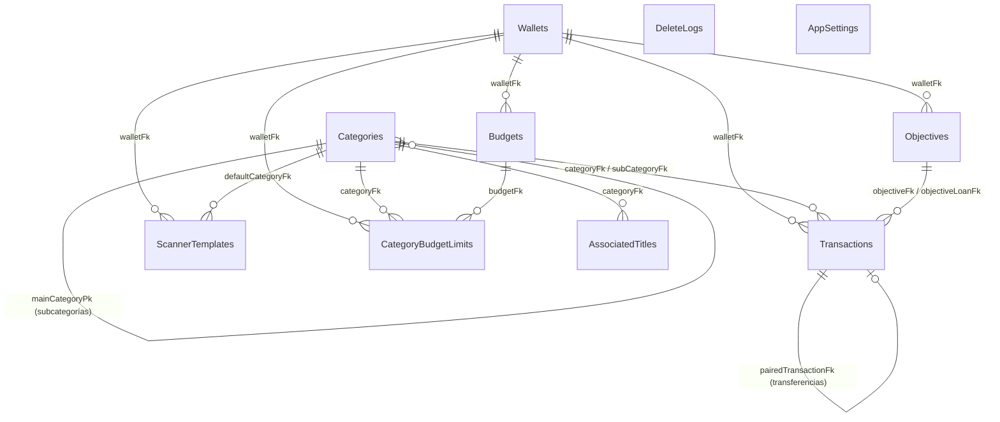

# Análisis del modelo de datos de Cashew

Este documento mapea el modelo de datos utilizado por Cashew hacia el esquema propuesto para Monetae, analizando las tablas de Drift, conceptos clave, historial de migraciones y una correspondencia directa entre ambas estructuras.

## a) Tablas Drift y Columnas

Las tablas están definidas en el archivo `lib/database/tables.dart`. Son 10 en total (se excluye `Labels` que aparece comentada en el código base):

### 1. DeleteLogs (`tables.dart:239`)
| Nombre | Tipo Drift | Nullable | Default | Notas |
|---|---|---|---|---|
| `deleteLogPk` (PK) | `TextColumn` | No | `uuid.v4()` | Clave primaria. |
| `entryPk` | `TextColumn` | No | - | ID de la entidad eliminada. |
| `type` | `IntColumn` | No | - | Enum `DeleteLogType`. |
| `dateTimeModified` | `DateTimeColumn` | No | `DateTime.now()` | Fecha de eliminación. |

### 2. Wallets (`tables.dart:251`)
| Nombre | Tipo Drift | Nullable | Default | Notas |
|---|---|---|---|---|
| `walletPk` (PK) | `TextColumn` | No | `uuid.v4()` | Clave primaria. |
| `name` | `TextColumn` | No | - | Nombre de la cuenta. |
| `colour` | `TextColumn` | Sí | - | |
| `iconName` | `TextColumn` | Sí | - | |
| `dateCreated` | `DateTimeColumn` | No | `DateTime.now()` | |
| `dateTimeModified` | `DateTimeColumn` | Sí | `DateTime.now()` | |
| `order` | `IntColumn` | No | - | |
| `currency` | `TextColumn` | Sí | - | |
| `currencyFormat` | `TextColumn` | Sí | - | |
| `decimals` | `IntColumn` | No | `2` | |
| `homePageWidgetDisplay`| `TextColumn` | Sí | `null` | Mapeado por `HomePageWidgetDisplayListInColumnConverter`. |

### 3. Transactions (`tables.dart:274`)
| Nombre | Tipo Drift | Nullable | Default | Notas |
|---|---|---|---|---|
| `transactionPk` (PK) | `TextColumn` | No | `uuid.v4()` | Clave primaria. |
| `pairedTransactionFk`| `TextColumn` | Sí | `null` | FK a `Transactions` (Transferencias). |
| `name` | `TextColumn` | No | - | |
| `amount` | `RealColumn` | No | - | Monto firmado (positivo o negativo). |
| `note` | `TextColumn` | No | - | |
| `categoryFk` | `TextColumn` | No | - | FK a `Categories`. |
| `subCategoryFk` | `TextColumn` | Sí | `null` | FK a `Categories`. |
| `walletFk` | `TextColumn` | No | `"0"` | FK a `Wallets`. |
| `dateCreated` | `DateTimeColumn` | No | `DateTime.now()` | |
| `dateTimeModified` | `DateTimeColumn` | Sí | `DateTime.now()` | |
| `originalDateDue` | `DateTimeColumn` | Sí | `DateTime.now()` | |
| `income` | `BoolColumn` | No | `false` | Indica si es ingreso (true) o gasto (false). |
| `periodLength` | `IntColumn` | Sí | - | Para recurrentes/suscripciones. |
| `reoccurrence` | `IntColumn` | Sí | - | Enum `BudgetReoccurence`. |
| `endDate` | `DateTimeColumn` | Sí | - | |
| `upcomingTransactionNotification` | `BoolColumn` | Sí | `true` | |
| `type` | `IntColumn` | Sí | - | Enum `TransactionSpecialType`. |
| `paid` | `BoolColumn` | No | `false` | Usado en préstamos para indicar si está saldo. |
| `createdAnotherFutureTransaction` | `BoolColumn` | Sí | `false` | |
| `skipPaid` | `BoolColumn` | No | `false` | |
| `methodAdded` | `IntColumn` | Sí | - | Enum `MethodAdded`. |
| `transactionOwnerEmail`| `TextColumn` | Sí | - | |
| `transactionOriginalOwnerEmail`| `TextColumn` | Sí | - | |
| `sharedKey` | `TextColumn` | Sí | - | |
| `sharedOldKey` | `TextColumn` | Sí | - | |
| `sharedStatus` | `IntColumn` | Sí | - | Enum `SharedStatus`. |
| `sharedDateUpdated`| `DateTimeColumn` | Sí | - | |
| `sharedReferenceBudgetPk`| `TextColumn` | Sí | - | |
| `objectiveFk` | `TextColumn` | Sí | - | FK a `Objectives`. |
| `objectiveLoanFk` | `TextColumn` | Sí | - | FK a `Objectives` (Préstamos). |
| `budgetFksExclude` | `TextColumn` | Sí | - | Convertidor a lista de Strings. |

### 4. Categories (`tables.dart:343`)
| Nombre | Tipo Drift | Nullable | Default | Notas |
|---|---|---|---|---|
| `categoryPk` (PK) | `TextColumn` | No | `uuid.v4()` | Clave primaria. |
| `name` | `TextColumn` | No | - | |
| `colour` | `TextColumn` | Sí | - | |
| `iconName` | `TextColumn` | Sí | - | |
| `emojiIconName` | `TextColumn` | Sí | - | |
| `dateCreated` | `DateTimeColumn` | No | `DateTime.now()` | |
| `dateTimeModified` | `DateTimeColumn` | Sí | `DateTime.now()` | |
| `order` | `IntColumn` | No | - | |
| `income` | `BoolColumn` | No | `false` | |
| `methodAdded` | `IntColumn` | Sí | - | Enum `MethodAdded`. |
| `mainCategoryPk` | `TextColumn` | Sí | `null` | FK a `Categories` (para subcategorías). |

### 5. CategoryBudgetLimits (`tables.dart:376`)
| Nombre | Tipo Drift | Nullable | Default | Notas |
|---|---|---|---|---|
| `categoryLimitPk` (PK) | `TextColumn` | No | `uuid.v4()` | Clave primaria. |
| `categoryFk` | `TextColumn` | No | - | FK a `Categories`. |
| `budgetFk` | `TextColumn` | No | - | FK a `Budgets`. |
| `amount` | `RealColumn` | No | - | |
| `dateTimeModified` | `DateTimeColumn` | Sí | `DateTime.now()` | |
| `walletFk` | `TextColumn` | No | `"0"` | FK a `Wallets`. |

### 6. AssociatedTitles (`tables.dart:395`)
| Nombre | Tipo Drift | Nullable | Default | Notas |
|---|---|---|---|---|
| `associatedTitlePk` (PK)| `TextColumn` | No | `uuid.v4()` | Clave primaria. |
| `categoryFk` | `TextColumn` | No | - | FK a `Categories`. |
| `title` | `TextColumn` | No | - | |
| `dateCreated` | `DateTimeColumn` | No | `DateTime.now()` | |
| `dateTimeModified` | `DateTimeColumn` | Sí | `DateTime.now()` | |
| `order` | `IntColumn` | No | - | |
| `isExactMatch` | `BoolColumn` | No | `false` | |

### 7. Budgets (`tables.dart:423`)
| Nombre | Tipo Drift | Nullable | Default | Notas |
|---|---|---|---|---|
| `budgetPk` (PK) | `TextColumn` | No | `uuid.v4()` | Clave primaria. |
| `name` | `TextColumn` | No | - | |
| `amount` | `RealColumn` | No | - | |
| `colour` | `TextColumn` | Sí | - | |
| `startDate` | `DateTimeColumn` | No | - | |
| `endDate` | `DateTimeColumn` | No | - | |
| `walletFks` | `TextColumn` | Sí | - | Mapeado por convertidor. |
| `categoryFks` | `TextColumn` | Sí | - | Mapeado por convertidor. |
| `categoryFksExclude`| `TextColumn` | Sí | - | Mapeado por convertidor. |
| `income` | `BoolColumn` | No | `false` | |
| `archived` | `BoolColumn` | No | `false` | |
| `addedTransactionsOnly`| `BoolColumn` | No | `false` | |
| `periodLength` | `IntColumn` | No | - | |
| `reoccurrence` | `IntColumn` | Sí | - | Enum `BudgetReoccurence`. |
| `dateCreated` | `DateTimeColumn` | No | `DateTime.now()` | |
| `dateTimeModified` | `DateTimeColumn` | Sí | `DateTime.now()` | |
| `pinned` | `BoolColumn` | No | `false` | |
| `order` | `IntColumn` | No | - | |
| `walletFk` | `TextColumn` | No | `"0"` | FK a `Wallets`. |
| `budgetTransactionFilters`| `TextColumn` | No | `null` | Mapeado por convertidor. |
| `memberTransactionFilters`| `TextColumn` | No | `null` | Mapeado por convertidor. |
| `sharedKey` | `TextColumn` | Sí | - | |
| `sharedOwnerMember`| `IntColumn` | Sí | - | Enum `SharedOwnerMember`. |
| `sharedDateUpdated`| `DateTimeColumn` | Sí | - | |
| `sharedMembers` | `TextColumn` | Sí | - | Mapeado por convertidor. |
| `sharedAllMembersEver`| `TextColumn` | Sí | - | Mapeado por convertidor. |
| `isAbsoluteSpendingLimit`| `BoolColumn` | No | `false` | |

### 8. AppSettings (`tables.dart:479`)
| Nombre | Tipo Drift | Nullable | Default | Notas |
|---|---|---|---|---|
| `settingsPk` (PK) | `IntColumn` | No | - | Auto-incremental. |
| `settingsJSON` | `TextColumn` | No | - | Guarda configuraciones, incluyendo multi-moneda. |
| `dateUpdated` | `DateTimeColumn` | No | `DateTime.now()` | |

### 9. ScannerTemplates (`tables.dart:489`)
| Nombre | Tipo Drift | Nullable | Default | Notas |
|---|---|---|---|---|
| `scannerTemplatePk` (PK)| `TextColumn` | No | `uuid.v4()` | Clave primaria. |
| `dateCreated` | `DateTimeColumn` | No | `DateTime.now()` | |
| `dateTimeModified` | `DateTimeColumn` | Sí | `DateTime.now()` | |
| `templateName` | `TextColumn` | No | - | |
| `contains` | `TextColumn` | No | - | |
| `titleTransactionBefore`| `TextColumn` | No | - | |
| `titleTransactionAfter` | `TextColumn` | No | - | |
| `amountTransactionBefore`| `TextColumn` | No | - | |
| `amountTransactionAfter`| `TextColumn` | No | - | |
| `defaultCategoryFk`| `TextColumn` | No | - | FK a `Categories`. |
| `walletFk` | `TextColumn` | No | `"0"` | FK a `Wallets`. |
| `ignore` | `BoolColumn` | No | `false` | |

### 10. Objectives (`tables.dart:515`)
| Nombre | Tipo Drift | Nullable | Default | Notas |
|---|---|---|---|---|
| `objectivePk` (PK) | `TextColumn` | No | `uuid.v4()` | Clave primaria. |
| `type` | `IntColumn` | No | `0` | Enum `ObjectiveType` (0=goal, 1=loan). |
| `name` | `TextColumn` | No | - | |
| `amount` | `RealColumn` | No | - | |
| `order` | `IntColumn` | No | - | |
| `colour` | `TextColumn` | Sí | - | |
| `dateCreated` | `DateTimeColumn` | No | `DateTime.now()` | |
| `endDate` | `DateTimeColumn` | Sí | - | |
| `dateTimeModified` | `DateTimeColumn` | Sí | `DateTime.now()` | |
| `iconName` | `TextColumn` | Sí | - | |
| `emojiIconName` | `TextColumn` | Sí | - | |
| `income` | `BoolColumn` | No | `false` | |
| `pinned` | `BoolColumn` | No | `true` | |
| `archived` | `BoolColumn` | No | `false` | |
| `walletFk` | `TextColumn` | No | `"0"` | FK a `Wallets`. |

### Diagrama Entidad-Relación

## b) Modelado de Conceptos Clave

- **Monto y Polaridad**: Aunque existe la columna `income` (`bool`), la columna `amount` (`real`) **guarda el signo de la transacción** (positivo para ingresos, negativo para gastos). Las consultas de base de datos directamente suman los montos (`transactions.amount.sum()` en `tables.dart:5704`). Cashew incluye una utilidad de mantenimiento (`fixTransactionPolarity` en `tables.dart:7579`) que corrige cualquier discrepancia calculando: `transaction.amount.abs() * (transaction.income ? 1 : -1)`.
- **Transacciones "Pagadas" vs "No pagadas"**: Para préstamos, la columna `paid` inicia en `true` y cambia a `false` al resolverse o pagarse. El comentario explícito del autor en `tables.dart:310-313` señala: "este es el opuesto de lo que se espera - pero es porque solo queremos que sume en los totales hasta que sea recibido/pagado resultando en un neto de 0".
- **Suscripciones, Recurrentes y Futuras**: Cashew usa los campos `type` (`TransactionSpecialType`), `periodLength`, `reoccurrence` (Enum `BudgetReoccurence`), `endDate` y `originalDateDue` para los 3 casos. La diferencia radica en el `type`:
  - `upcoming` [inferencia]: Transacción única en el futuro.
  - `subscription` [inferencia]: Servicio recurrente (ej. Netflix).
  - `repetitive` [inferencia]: Ingreso/Gasto regular (ej. salario mensual).
- **Cuentas (Wallets)**: Definen su moneda local (`currency`), pero NO hay una tabla multi-moneda.
- **Monedas y Tipos de Cambio**: Cashew inyecta un JSON global (`customCurrencyAmounts`) directamente en la tabla `AppSettings` (campo `settingsJSON`).
- **Presupuestos (Budgets)**: Definen su periodo usando `periodLength` y `reoccurrence`. Excluyen categorías guardando los IDs convertidos a strings en `categoryFksExclude` (`tables.dart:436`). Poseen filtros avanzados en `budgetTransactionFilters` mapeados vía convertidor `BudgetTransactionFiltersListInColumnConverter` (`tables.dart:454`).
- **Objetivos y Préstamos**: Comparten la tabla `Objectives`, diferenciándose por el enum `ObjectiveType` (`goal` o `loan`).

## c) Historial de Versiones y Migraciones (Drift)

- **Esquemas JSON**: Cashew usa snapshots almacenados en la carpeta `drift_schemas/` con un rango verificado de 14 archivos, desde `drift_schema_v33.json` hasta `drift_schema_v46.json`.
- **Versión global**: La versión actual expuesta al sistema es `46` (`schemaVersionGlobal = 46` en `tables.dart:29`).
- **Migraciones Clave en `tables.dart`**:
  - `from36To37` (`tables.dart:880`): Re-arquitectura importante donde se mutaron exhaustivamente todas las PKs y FKs a texto (`.cast<String>()`), pasando de IDs auto-incrementales a UUIDs.
  - `from37To38` (`tables.dart:952`): Se introdujo el soporte histórico formal de recurrencia mediante la creación de la columna `originalDateDue` en la tabla `Transactions`.

## d) Tabla de Correspondencia: Cashew → Monetae

| Tabla Monetae | Tabla/Concepto Cashew | Notas sobre la brecha o adaptación |
|---------------|-----------------------|------------------------------------|
| `users` | N/A (parcial en Firebase/`AppSettings`) | Cashew carece de multi-usuario en BD; asume configuración simple por dispositivo. |
| `accounts` | `Wallets` | Correspondencia muy directa. |
| `categories` | `Categories` | Cashew anida con `mainCategoryPk`. |
| `people` | N/A (mezclado en `Objectives`) | Monetae usará una tabla dedicada a personas. |
| `transactions` | `Transactions` | En Monetae será una entidad más enfocada en movimientos puros, no saturada. |
| `loans` | `Objectives` (donde type = `loan`) | Monetae independiza el Ledger de préstamos. Cashew usa un hack con `Objective`. |
| `loan_movements` | `Transactions` (vía `objectiveLoanFk`)| Monetae registrará abonos e interés de forma explícita (Problema P1/P2/P3). |
| `subscriptions` | `Transactions` (type = `subscription`) | Monetae usará tabla separada en vez de sobrecargar `Transactions`. |
| `recurring_rules` | `Transactions` (type = `repetitive`) | Se separa la regla recurrente de las transacciones generadas. |
| `budgets`, `budget_categories` | `Budgets`, `CategoryBudgetLimits` | Concepto similar. |
| `goals`, `goal_transactions` | `Objectives` (type = `goal`) | Equivalente. |
| `category_rules` | `AssociatedTitles`, `ScannerTemplates` | En Monetae se consolidará de manera flexible. |
| `notifications`, `notification_prefs` | N/A | No hay infraestructura de notificaciones puras locales. |
| `exchange_rates` | N/A (`AppSettings.settingsJSON`) | Monetae lo formaliza para no sobrescribir el historial de tipos de cambio. |

## Dudas Abiertas / Inconclusas

- **Historial de conversión FX**: Se verificó que el cálculo es volátil dependiente de `customCurrencyAmounts` global. Esto rompe la contabilidad de transacciones en moneda foránea pasadas si el usuario cambia el tipo de cambio hoy.
- **Hack de transacciones "pagadas"**: El campo `paid` invertido (`true`=no pagado) es un parche contable en Cashew. En Monetae se requerirá estricta cautela al desarrollar el importador.
- **Categorías "borradas"**: La tabla `DeleteLogs` asume uso esporádico. Monetae usará borrado lógico (`deleted_at`), pudiendo ignorar los logs al importar.
